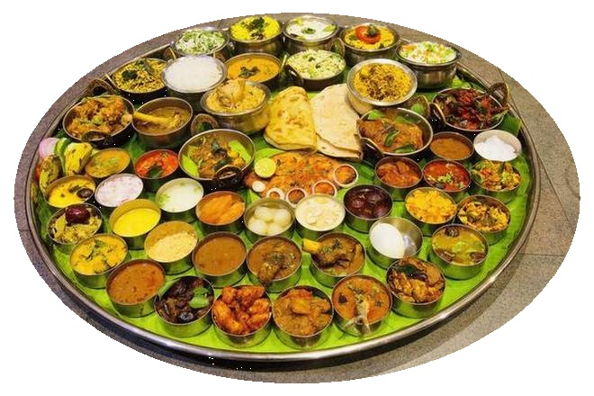

# Zomato India Data Analysis

 
I have crawled over 0.23 million restaurant data and bring some visualisation and insights from that.

Day by day online purchasing trend is increasing in India. This genearates massive amount of data to process and visualise. One day while ordering in zomato, I wondered how many places these guys are delivering food. So I checked their website and found they are offering this service in 20+ countries. That's massive. I thought we can get a lot of data to anaylze. But before proceeding, I checked out in kaggle for similar dataset. Two were there, but. One has much data but only for bangalore. Other has very small data using zomato api but for whole India. So I thought of creating a new dataset covering whole India . So I crawled the zomato site and got this data. Thats a teadious work. But its worthy. Then I visualised and analysed the data. But I was late. This data was taken 4 months before.

This is the initial analysis. A lot more to come in next versions.

<b>Note:</b> I'm uploading two CSV files. One before data cleaning (india_all_restaurants_details.csv) and other after cleaning data(indian_restaurants_details_cleaned_data.csv).

<b>DISCLAIMER:</b> Data in this dataset belongs to "Zomato Media Private Limited". I have taken this data only for educational purpose.
